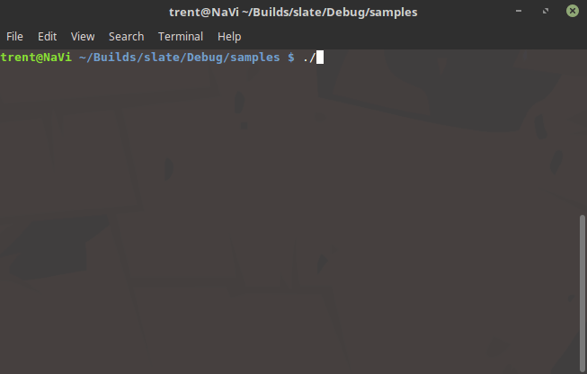

QCurses
=======

QCurses is a Qt-inspired C wrapper over top of NCurses text input mode.
This project contains prototype code to learn how to work with Curses,
as well as provide a proof-of-concept abstraction over-top of the existing API.



About the Name
--------------

Pretty self-explanatory, QCurses is simply a Qt-like layer overtop of existing NCurses.
Since the input mode is traditionally known as "curses", we have dropped the N for the name.

Qt-like Curses = QCurses!

How to Build
------------

The only dependency is NCurses.
Simply make sure that the NCurses libraries can be discovered by CMake and build!

Here is a sample bash sequence that will build QCurses and samples in Debug mode:

```bash
$ cd /path/to/build/dir
$ cmake /path/to/source/dir
$ make -j8
```

Credits
-------

QCurses is being developed independently by Trent Reed (2017).
